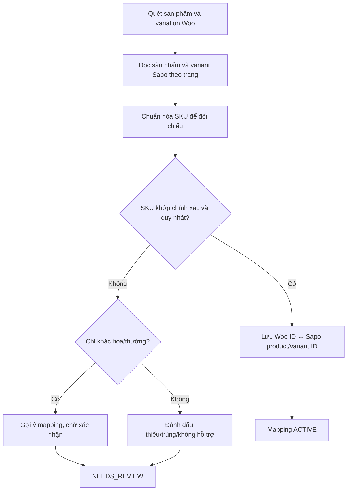
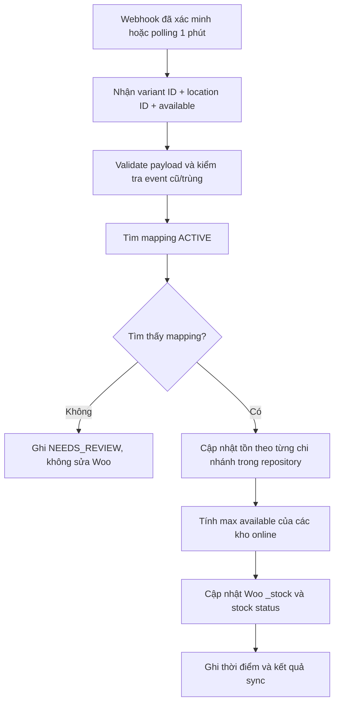
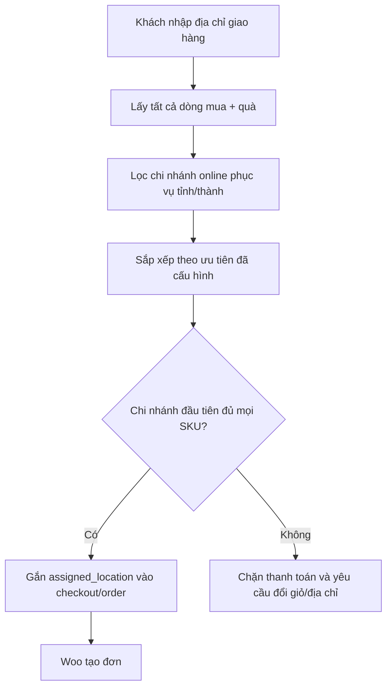
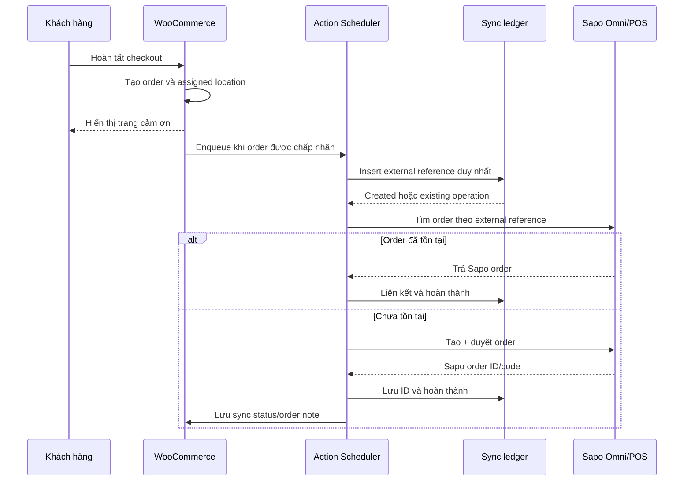
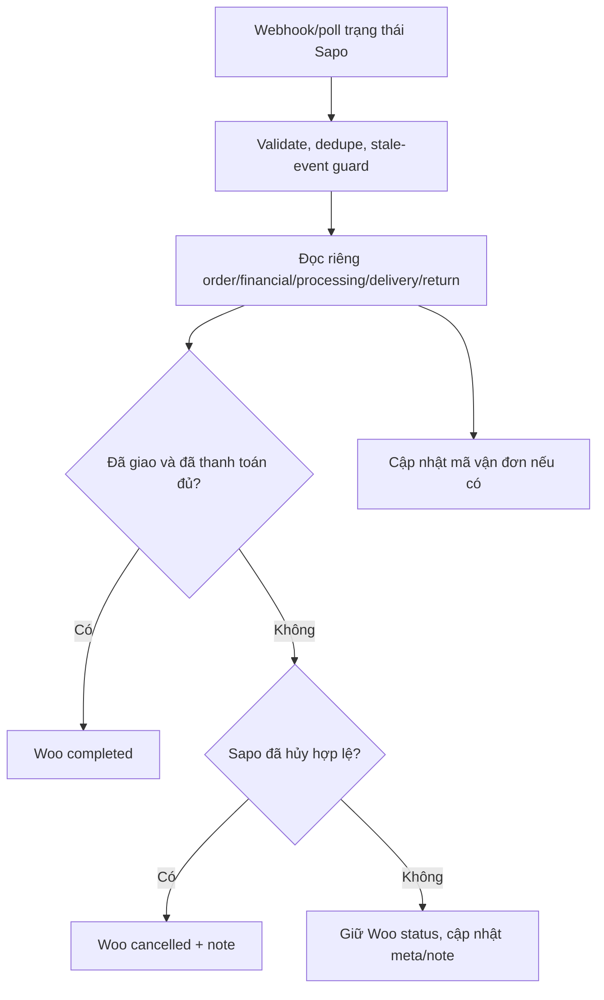
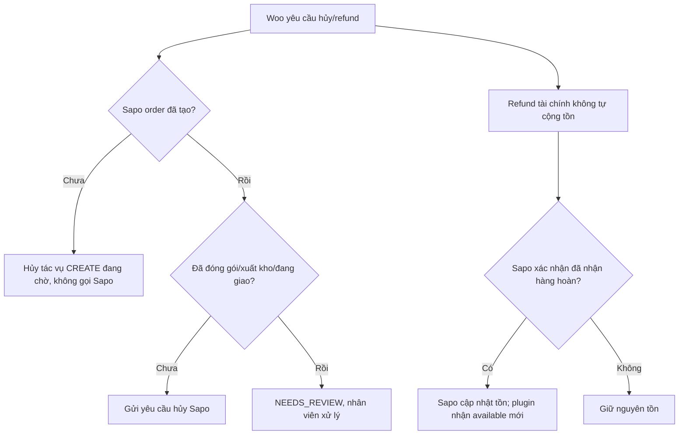

# Luồng đồng bộ WooCommerce – Sapo

Tài liệu này mô tả flow đang triển khai. Plugin `0.4.0` đã có read adapter Sapo và realtime
reconciliation; thao tác ghi đơn vẫn bị khóa cho đến khi capability gate/contract test đạt.

## 1. Mapping sản phẩm



Nguyên tắc:

- SKU chỉ tìm liên kết lần đầu.
- Sau khi `ACTIVE`, mọi order/inventory flow dùng Sapo variant ID đã lưu.
- Tên và content chỉ hiển thị cho admin, không ảnh hưởng quyết định mapping.
- Nếu SKU thay đổi trong khi Sapo ID còn nguyên, tạm dừng mapping để xác nhận.

## 2. Đồng bộ tồn kho



Không gửi thay đổi `_stock` này ngược về Sapo. Tài liệu Sapo hiện không công bố topic tồn kho
riêng, nên topic product/store kích hoạt reconciliation ngay; polling mỗi phút sửa sai lệch do
webhook bị mất hoặc event đến sai thứ tự.

## 3. Phân kho tại checkout



Không cộng tồn nhiều chi nhánh để đáp ứng một đơn. Trước khi gửi Sapo, worker kiểm tra lại assigned location để xử lý tình huống tồn thay đổi đồng thời.

## 4. WooCommerce → Sapo



Nếu request tạo đơn timeout, operation không được POST lại ngay. Worker kế tiếp phải tìm theo external reference trước, rồi mới quyết định retry.

## 5. Điều kiện gửi đơn

| Woo status/tình huống | Hành động |
| --- | --- |
| `pending` | Chưa gửi |
| `on-hold` | Chưa gửi theo mặc định |
| COD vào `processing` | Tạo và duyệt Sapo |
| Online payment vào `processing` | Tạo và duyệt Sapo |
| `failed` trước khi gửi | Đánh dấu bỏ qua |
| `cancelled` trước khi gửi | Đánh dấu bỏ qua |
| Tồn assigned location thay đổi và không còn đủ | Không tạo đơn thiếu; chuyển `NEEDS_REVIEW` |

## 6. Sapo → WooCommerce



```text
Webhook product/store (và inventory/stock nếu tài khoản phát) → event inbox → Action Scheduler
reconciliation → đọc `inventory_levels.available` theo location → cập nhật Woo. Polling mỗi phút
là safety net bắt buộc cho tồn kho.
```

Không cố ép mọi trạng thái giao hàng của Sapo thành một Woo status. Các trạng thái chi tiết được lưu ở meta và order note; chỉ chuyển Woo khi có quy tắc chắc chắn.

## 7. Hủy và hoàn hàng



## 8. Retry và lỗi

| Nhóm lỗi | Xử lý |
| --- | --- |
| Timeout/network | Tìm lại bằng external reference, sau đó retry có backoff |
| Rate limit | Tôn trọng retry hint nếu có, thêm jitter |
| Sapo `5xx` | Retry có giới hạn |
| Auth/scope | Dừng connector và cảnh báo admin |
| Mapping/SKU | Chuyển `NEEDS_REVIEW` |
| Validation dữ liệu | Không retry tự động cho đến khi dữ liệu được sửa |
| Conflict/tồn không đủ | Không tạo đơn một phần; duyệt tay |
| Webhook trùng/cũ | Bỏ qua nhưng vẫn ghi nhận audit |

Retry không chỉ ghi timestamp: worker phải enqueue lại operation theo `next_attempt_at`; nếu
không có Action Scheduler/WP-Cron thì chuyển `NEEDS_REVIEW` để tránh backlog giả.

## 9. Flow mở rộng loại sản phẩm

Domain sử dụng `ProductTypeHandler`:

```text
SIMPLE       → triển khai trong MVP
VARIATION    → triển khai trong MVP
COMBO        → handler tương lai
CONVERTED    → handler tương lai
LOT          → handler tương lai
SERIAL       → handler tương lai
```

Handler tương lai chịu trách nhiệm xác định inventory subject, cách tạo order line và yêu cầu fulfillment riêng. Outbox, webhook inbox, retry và audit log tiếp tục dùng chung.
